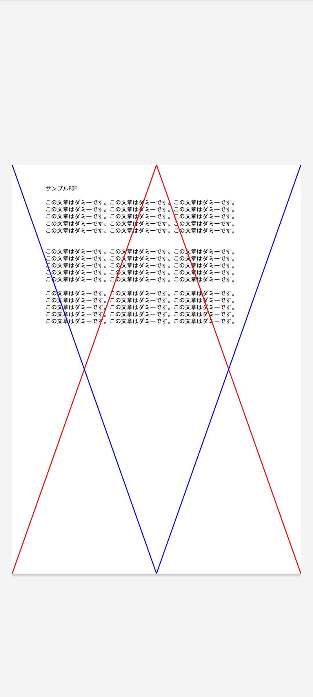
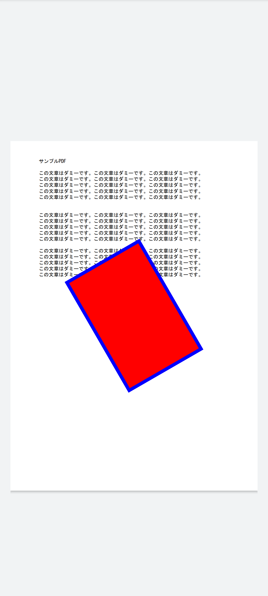
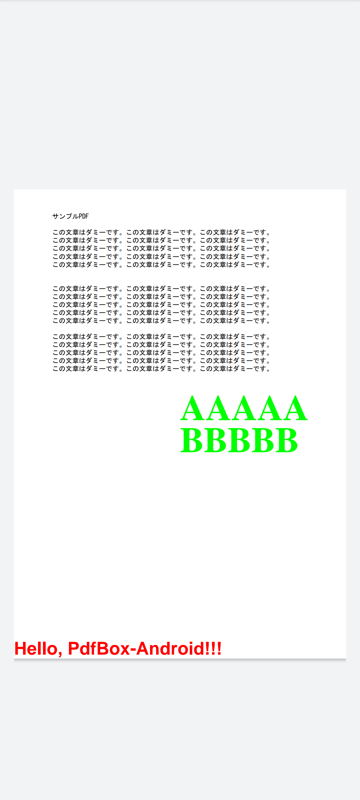
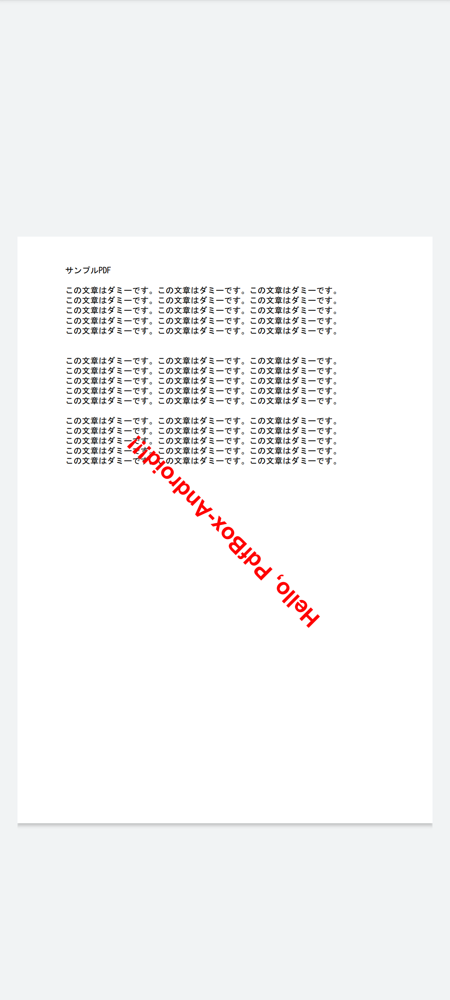
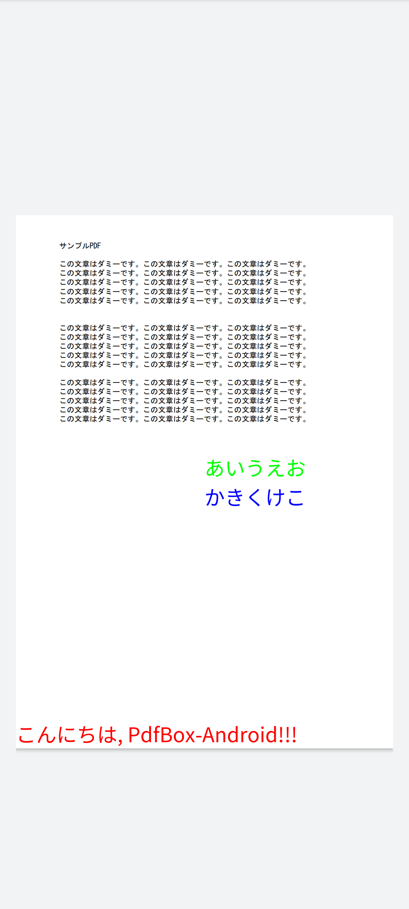
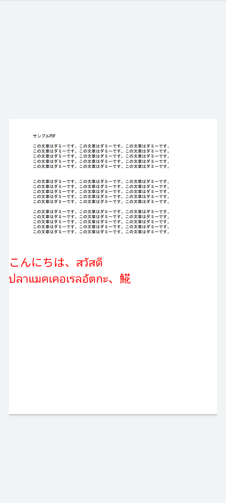
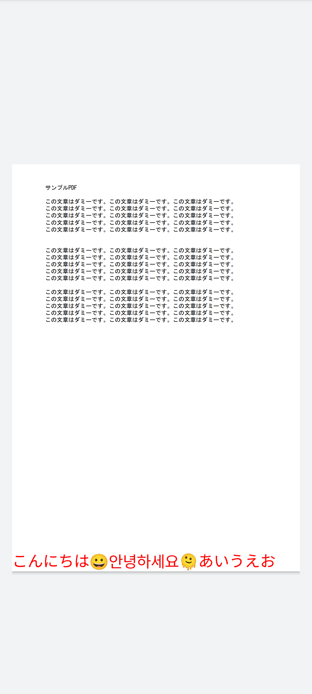

# PdfBoxSample

[PdfBox-Android](https://github.com/TomRoush/PdfBox-Android) を使ったサンプルプロジェクトです。
以下のサンプルを確認することができます。

- [線を書き込む](#線を書き込む)
- [座標変換した矩形を書き込む](#座標変換した矩形を書き込む)
- [テキストを書き込む](#テキストを書き込む)
- [座標変換したテキストを書き込む](#座標変換したテキストを書き込む)
- [日本語のテキストを書き込む](#日本語のテキストを書き込む)
- [1行に複数の言語が含まれるテキストを書き込む](#1行に複数の言語が含まれるテキストを書き込む)
- [絵文字などのテキストを画像として出力する](#絵文字などのテキストを画像として出力する)

## 線を書き込む

## 座標変換した矩形を書き込む

## テキストを書き込む

## 座標変換したテキストを書き込む

## 日本語のテキストを書き込む

## 1行に複数の言語が含まれるテキストを書き込む

## 絵文字などのテキストを画像として出力する

